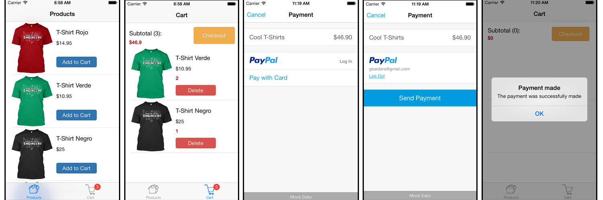

Shopping cart example app
=========================

This is a simple iOS app that demonstrates the functionality of a shopping cart.

This project uses [CocoaPods](http://cocoapods.org/) for managing its dependencies. So make sure you open ShoppingCartExample.xcworkspace. 

If you are new to **CocoaPods**, I recommend this [explanation](http://nshipster.com/cocoapods/).

## Third party libraries and utilities

- [FMDB](https://github.com/ccgus/fmdb)
- [BButton](https://github.com/mattlawer/BButton)
- [Paypal iOS SDK](https://github.com/paypal/PayPal-iOS-SDK)

### Icons
The icons used here are from [Icons8](http://icons8.com/free-ios-7-icons-in-vector/).

### Products
The products images are from [Trust Me, I'm An Engineer Campaign](http://teespring.com/engineermemes) on **Teespring**.